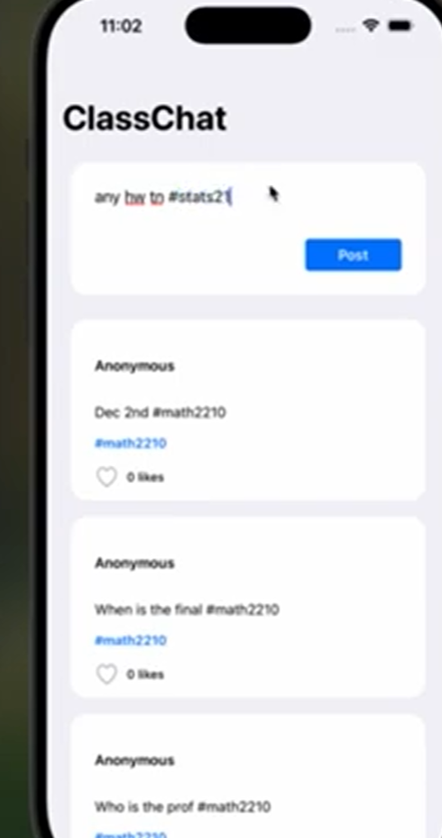
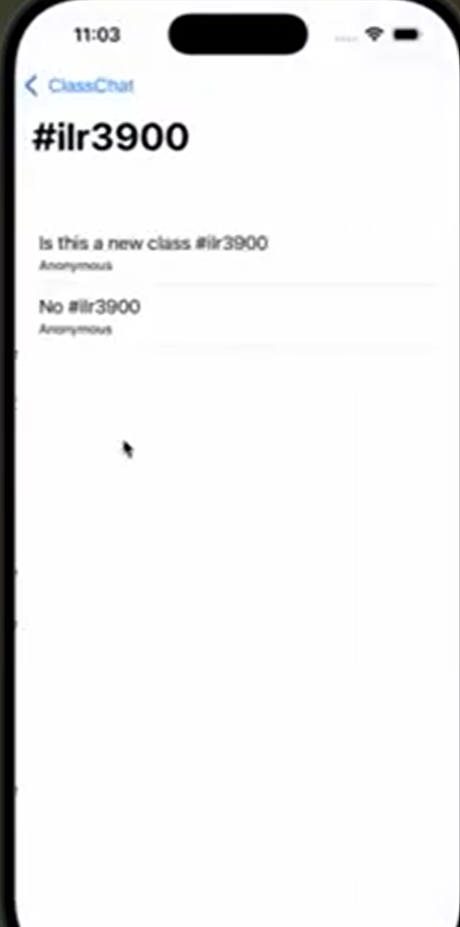

# App-Dev-Hack-Challenge-Team-8

ClassChat
Group/Class based discussion app

Description:  An app where people can post and create chats to help them succeed academically. You can post a class or topic you are struggling with and people can join a group (study group) to talk and share resources for that subject.

<h1>App Screenshots</h1>

  
  

# Requirements
Backend Requirement: Our backend implements over a dozen routes, with each operation (GET, POST, DELETE) being implemented
at least once in one of the dozen routes. We have four tables for groups, users, posts, and tags in our database with users having
a many to many relationship with the groups and a one to many relationship with the posts, and with tags having a many to many realtionships with posts and tags and a one to one with groups. API Specification is in API_Spec.md.

Frontends:
- Built a scrollable main feed using UIKit with postcards and a create-post text field at the top
- Added toggleable like buttons and tappable hashtags on each post, hashtags navigate to a second page that displays all posts with the same tag
- Implemented networking to fetch posts and create new posts through the backend API

Designers:

